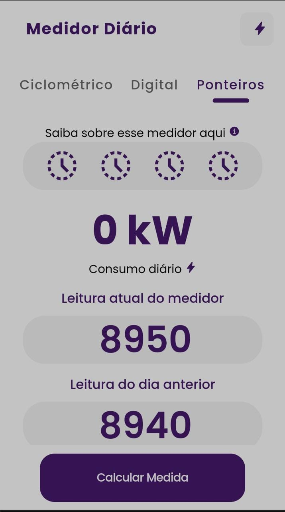

# Medidor Diário

<!---Esses são exemplos. Veja https://shields.io para outras pessoas ou para personalizar este conjunto de escudos. Você pode querer incluir dependências, status do projeto e informações de licença aqui--->




> Aplicativo para medir consumo diário de energia seguindo modelos da equatorial, tenha o resultado facil e rápido.

### Novas funcionalidades e melhorias

O projeto foi concluido mas segue para futuras atualizações serão voltadas nas seguintes tarefas:

- [x] Calculo do consumo diário 1
- [x] Redirecionar para informações gerais
- [ ] Calculo do consumo com base nos aparelhos
- [ ] Salvar registros 

## 💻 Pré-requisitos

Antes de começar, verifique se você atendeu aos seguintes requisitos:
<!---Estes são apenas requisitos de exemplo. Adicionar, duplicar ou remover conforme necessário--->
* Você instalou a versão mais recente de `Ionic 6, Node 16.10.0, `
* Saiba sobre Capacitor com Ionic

## 🚀 Instalando Medidor diário

Para instalar o  Medidor diário, siga estas etapas:

Linux e macOS:
```
ionic capacitor run android

```

Windows:
```
ionic capacitor run android
```


Adicione comandos de execução e exemplos que você acha que os usuários acharão úteis. Fornece uma referência de opções para pontos de bônus!

## 📫 Contribuindo para <nome_do_projeto>
Para contribuir com  Medidor diário, siga estas etapas:

1. Bifurque este repositório.
2. Crie um branch: `git checkout -b <nome_branch>`.
3. Faça suas alterações e confirme-as: `git commit -m '<mensagem_commit>'`
4. Envie para o branch original: `git push origin <nome_do_projeto> / <local>`
5. Crie a solicitação de pull.

Como alternativa, consulte a documentação do GitHub em [como criar uma solicitação pull](https://help.github.com/en/github/collaborating-with-issues-and-pull-requests/creating-a-pull-request).

## 🤝 Desenvolvedor

Criador:

<table>
  <tr>
    <td align="center">
      <a href="#">
        <br>
        <sub>
          <b>Mairton Leal</b>
        </sub>
      </a>
    </td>

  </tr>
</table>


## 😄 Seja um dos contribuidores<br>

Quer fazer parte desse projeto? Clique [AQUI](CONTRIBUTING.md) e leia como contribuir.

## 📝 Licença

Esse projeto está sob licença. Veja o arquivo [LICENÇA](LICENSE.md) para mais detalhes.

[⬆ Voltar ao topo](#nome-do-projeto)<br>
